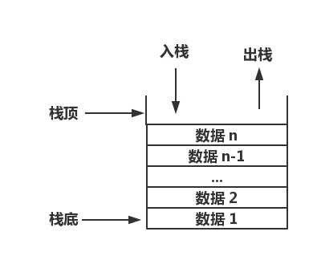

# 栈结构
> 栈（Stack）是从数据的运算来分类的，按照 `后进先出（Last In First Out，LIFO）` 的原则处理节点数据的；在终端处理特别是重要数据的现场保护有着重要意义。而从数据的逻辑结构来看，栈结构其实就是一种线性结构。栈结构包括两类：



## 栈结构包括两类
1. 顺序栈结构
2. 链式栈结构

## (顺序)栈操作实例代码

### 数据准备
#### 定义（顺序）栈结构
``` C
/** 栈的最大长度 */
#define MAX_LEN 100


/** 链表操作返回值 */
typedef enum {
    Ret_Error           = -1,           // 操作出错
    Ret_NO              = 0,            // 操作失败
    Ret_YES             = 1,            // 操作成功
}RetValue;


/** 栈结点类型 */
typedef struct {
    char key[15];                       // 学号
    char name[20];                      // 姓名
    int age;                            // 年龄
}NodeData;


/** (顺序)栈结构 */
typedef struct {
    NodeData stackData[MAX_LEN];        // 数据元素
    int stackTop;                       // 栈顶位置
}SSType;
```
### （顺序）相关操作
#### （顺序）栈初始化
``` C
SSType* StackInit()
{
    SSType *pStack;
    if (!(pStack = (SSType *)malloc(sizeof(SSType))))
    {
        printf("无法分配栈内存，栈初始化失败！\n");
        return NULL;
    }
    pStack->stackTop = 0;
    return pStack;
}
```

#### （顺序）栈为空判断
``` C
RetValue StackIsEmpty(SSType* pStack)
{
    if (NULL == pStack)
    {
        printf("栈指针不存在，无法进行为空判断！\n");
        return Ret_Error;
    }
    
    if (0 == pStack->stackTop)
    {
        return Ret_YES;
    }
    else
    {
        return Ret_NO;
    }
}
```

#### （顺序）栈填满判断
``` C
RetValue StackIsFull(SSType* pStack)
{
    if (NULL == pStack)
    {
        printf("栈指针不存在，无法进行填满判断！\n");
        return Ret_Error;
    }
    
    if (MAX_LEN == pStack->stackTop)
    {
        return Ret_YES;
    }
    else
    {
        return Ret_NO;
    }
}
```

#### （顺序）栈清空
``` C
RetValue StackClear(SSType* pStack)
{
    if (NULL == pStack)
    {
        printf("栈指针不存在，无法进行栈清空！\n");
        return Ret_Error;
    }
    
    pStack->stackTop = 0;
    return Ret_YES;
}
```

#### （顺序）栈释放
``` C
RetValue StackFree(SSType* pStack)
{
    if (NULL == pStack)
    {
        printf("栈指针不存在，无法进行栈释放！\n");
        return Ret_Error;
    }
    
    free(pStack);
    return Ret_YES;
}
```

#### 入（顺序）栈
``` C
RetValue StackPush(SSType* pStack, NodeData nData)
{
    if (NULL == pStack)
    {
        printf("栈指针不存在，无法入栈！\n");
        return Ret_Error;
    }
    if (Ret_YES == StackIsFull(pStack))
    {
        printf("栈已满，无法入栈！\n");
        return Ret_Error;
    }
    
    pStack->stackData[pStack->stackTop] = nData;
    pStack->stackTop++;
    
    return Ret_YES;
}
```

#### 出（顺序）栈
``` C
RetValue StackPop(SSType* pStack, NodeData* nData)
{
    if (NULL == pStack)
    {
        printf("栈指针不存在，无法出栈！\n");
        return Ret_Error;
    }
    if (Ret_YES == StackIsEmpty(pStack))
    {
        printf("栈为空，无法出栈！\n");
        return Ret_Error;
    }
    
    pStack->stackTop--;
    *nData = pStack->stackData[pStack->stackTop];
    
    return Ret_YES;
}
```

#### 读取（顺序）栈顶节点数据
``` C
RetValue StackPeek(SSType* pStack, NodeData* peekData)
{
    if (NULL == pStack)
    {
        printf("栈指针不存在，无法读取栈顶数据！\n");
        return Ret_Error;
    }
    if (Ret_YES == StackIsEmpty(pStack))
    {
        printf("栈为空，栈顶数据不存在！\n");
        return Ret_Error;
    }
    
    *peekData = pStack->stackData[pStack->stackTop - 1];
    
    return Ret_YES;
}
```

#### 显示（顺序）栈所有数据
``` C
RetValue StackShowAll(SSType* pStack)
{
    if (NULL == pStack)
    {
        printf("栈指针不存在，无法显示栈所有数据！\n");
        return Ret_Error;
    }
    if (Ret_YES == StackIsEmpty(pStack))
    {
        printf("栈为空，栈数据不存在！\n");
        return Ret_Error;
    }
    
    for (int i = 0; i < pStack->stackTop; i++)
    {
        printf("key = %-15s name = %-20s age = %d\n", pStack->stackData[i].key, pStack->stackData[i].name, pStack->stackData[i].age);
    }
    return Ret_YES;
}
```

## (链式)栈操作实例代码

### 数据准备
#### 定义（链式）栈结构
``` C
/** 栈作返回值 */
typedef enum {
    RetError            = -1,           // 操作出错
    RetFailure          = 0,            // 操作失败
    RetSuccess          = 1,            // 操作成功
}RetValue;


/** 栈结点类型 */
typedef struct {
    char key[15];                       // 学号
    char name[20];                      // 姓名
    int age;                            // 年龄
}NodeData;


/** （链式）栈结构 */
typedef struct node {
    NodeData nodeData;                  // 保存结点数据
    struct node* nextNode;              // 保存下一结点的地址
}LSType;

```

#### 定义“头”结构
``` C
/** 链表头 */
typedef struct _head {
    LSType* headNode;                   // 保存链表头结点地址
    LSType* tailNode;                   // 保存链表尾结点地址
    unsigned int clLength;              // 链表长度
}Head;
```

### （链式）相关操作
#### （链式）栈初始化
``` C
Head* LStackInit()
{
    Head* pHead;
    if (!(pHead = (Head*)malloc(sizeof(Head))))
    {
        printf("无法分配栈头指针内存，（链式）栈初始化失败！\n");
        return NULL;
    }
    pHead->headNode = NULL;
    pHead->tailNode = NULL;
    pHead->clLength = 0;
    
    return pHead;
}
```

#### 入（链式）栈
``` C
RetValue LStackPush(Head* pHead, NodeData inData)
{
    if (NULL == pHead)
    {
        printf("（链式）栈指针不存在，无法入栈\n");
        return RetError;
    }
    LSType* newNode;
    if (!(newNode = (LSType*) malloc(sizeof(LSType))))
    {
        printf("新添加结点内存申请失败，无法入栈！\n");
        return RetFailure;
    }
    newNode->nodeData = inData;
    newNode->nextNode = NULL;
    if (NULL == pHead->tailNode)
    {
        pHead->headNode = newNode;
    }
    else
    {
        pHead->tailNode->nextNode = newNode;
    }
    pHead->tailNode = newNode;
    pHead->clLength++;
    
    return RetSuccess;
}
```

#### 出（链式）栈
``` C
RetValue LStackPop(Head* pHead, NodeData* outData)
{
    if (NULL == pHead)
    {
        printf("（链式）栈指针不存在，无法入栈\n");
        return RetError;
    }
    if (NULL == pHead->tailNode)
    {
        printf("栈内无结点，无法出栈！\n");
        return RetFailure;
    }

    memcpy(outData, &pHead->tailNode->nodeData, sizeof(NodeData));
    
    LSType* tempHead = pHead->headNode;
    LSType* deleteNode = pHead->headNode;
    while (NULL != deleteNode->nextNode)
    {
        tempHead   = deleteNode;
        deleteNode = tempHead->nextNode;
    }
    tempHead->nextNode = NULL;
    pHead->tailNode    = tempHead;
    pHead->clLength--;
    
    free(deleteNode);
    
    return RetSuccess;
}
```

#### 判断（链式）栈是否为空
``` C
RetValue LStackIsEmpty(Head* pHead)
{
    if (NULL == pHead)
    {
        printf("（链式）栈指针不存在，无法进行为空判断！\n");
        return RetError;
    }
    if (0 == pHead->clLength)
    {
        return RetSuccess;
    }
    return RetFailure;
}
```

#### 销毁（链式）栈
``` C
RetValue LStackDestroy(Head* pHead)
{
    if (NULL == pHead)
    {
        printf("（链式）栈指针不存在，无法销毁栈\n");
        return RetError;
    }
    LSType* tempHead;
    while (pHead->headNode)
    {
        tempHead = pHead->headNode;
        pHead->headNode = pHead->headNode->nextNode;
        free(tempHead);
    }
    pHead->tailNode = NULL;
    pHead->headNode = NULL;
    free(pHead);
    
    return RetSuccess;
}
```

#### 读取（链式）栈顶数据
``` C
RetValue LStackPeek(Head* pHead, NodeData* peekData)
{
    if (NULL == pHead)
    {
        printf("（链式）栈指针不存在，无法读取栈顶数据！\n");
        return RetError;
    }
    if (RetSuccess == LStackIsEmpty(pHead))
    {
        printf("（链式）栈为空，栈顶数据不存在！\n");
        return RetError;
    }
    
    *peekData = pHead->tailNode->nodeData;
    
    return RetSuccess;
}
```

#### 显示（链式）栈所有结点数据
``` C
RetValue LStackShowAll(Head* pHead)
{
    if (NULL == pHead)
    {
        printf("(链式)栈指针不存在，无法显示栈所有数据！\n");
        return RetError;
    }
    if (RetSuccess == LStackIsEmpty(pHead))
    {
        printf("（链式）栈为空，栈数据不存在！\n");
        return RetFailure;
    }
    LSType* tempHead = pHead->headNode;
    while (tempHead)
    {
        printf("key = %-15s name = %-20s age = %d\n", tempHead->nodeData.key, tempHead->nodeData.name, tempHead->nodeData.age);
        tempHead = tempHead->nextNode;
    }
    return RetSuccess;
}
```